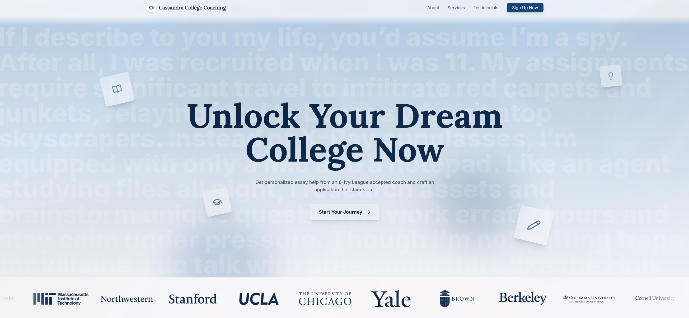
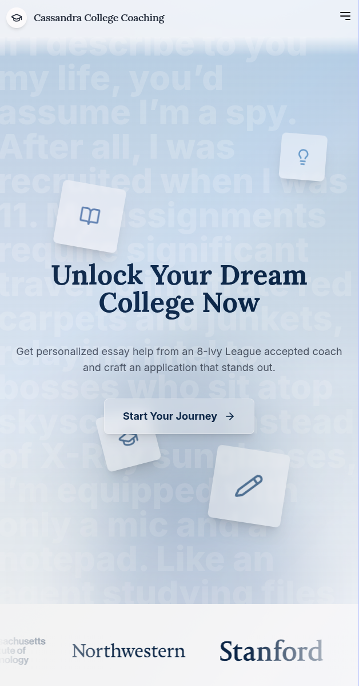

# Cassandra College Coaching

A modern, responsive landing page for a college coaching service, built with Vite, React, and Tailwind CSS.

## Project Demo

| Desktop | Mobile |
| :---: | :---: |
|  |  |

## Features

- **Responsive Design**: Fully functional and visually appealing on all devices, from mobile phones to desktops.
- **Modern UI/UX**: Smooth animations and a clean, professional layout built with Framer Motion.
- **Glassmorphism Effects**: Sleek, transparent UI elements for a cutting-edge look.
- **Dynamic Content**: Features an animated typing background to engage users.

## Tech Stack

- [**Vite**](https://vitejs.dev/) - Next-generation frontend tooling.
- [**React**](https://reactjs.org/) - A JavaScript library for building user interfaces.
- [**TypeScript**](https://www.typescriptlang.org/) - Typed JavaScript for robust applications.
- [**Tailwind CSS**](https://tailwindcss.com/) - A utility-first CSS framework for rapid UI development.
- [**Framer Motion**](https://www.framer.com/motion/) - A production-ready motion library for React.

## Getting Started

To run this project locally, follow these steps:

1.  **Clone the repository:**
    ```bash
    git clone https://github.com/qtzx06/cassandra-college-coaching.git
    cd cassandra-college-coaching
    ```

2.  **Install dependencies:**
    ```bash
    npm install
    ```

3.  **Start the development server:**
    ```bash
    npm run dev
    ```

The application will be available at `http://localhost:5173`.